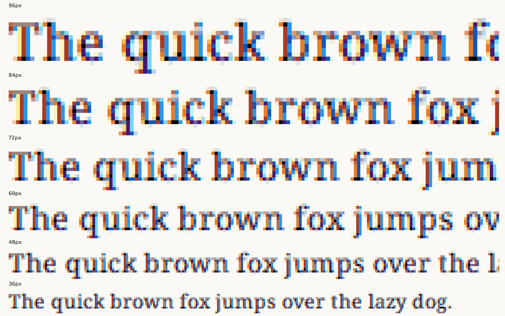

## Font Description

**Coral Pixels** is a color font inspired by subpixel rendering techniques. It elevates the retro pixel font style commonly seen in games and digital art by infusing it with color, creating a more vibrant and dynamic digital aesthetic. Beyond being merely a font, it offers a new dimension for visual expression.

- **Subpixel Rendering Expression:** By applying display technology to font design, Coral Pixels creates a depth and dimensionality not typically found in traditional fonts. This innovative approach could inspire new ideas for retro game pixel art.
- **Rich Color Expression:** The font's glyphs, when viewed from a distance, appear as blurred black text. However, upon closer inspection, they reveal a random arrangement of colorful dots, offering a unique and visually engaging experience.
- **Transparency Implementation:** Coral Pixels incorporates transparency into its color elements to minimize the occurrence of unsightly fringes. While this design choice enhances the font's appearance, it can result in a loss of color vibrancy when used against dark backgrounds. As a temporary workaround, we recommend using color inversion or other adjustments within your application.

## Features

### Language support

Support for **88 languages** detected by [FontDrop!](https://fontdrop.info), which are:

> Afrikaans, Albanian, Asu, Basque, Bemba, Bena, Breton, Catalan, Chiga, Colognian, Cornish, Croatian, Czech, Danish,　Dutch, English, Estonian, Faroese, Filipino, Finnish, French, Friulian, Galician, Ganda, German, Gusii, Hungarian, Icelandic, Inari Sami, Indonesian, Irish, Italian, Jola-Fonyi, Kabuverdianu, Kalenjin, Kinyarwanda, Latvian,　Lithuanian, Lower Sorbian, Luo, Luxembourgish, Luyia, Machame, Makhuwa-Meetto, Makonde, Malagasy, Maltese, Manx, Morisyen, North Ndebele, Norwegian Bokmal, Norwegian Nynorsk, Nyankole, Oromo, Polish, Portuguese, Quechua, Romanian, Romansh, Rombo, Rundi, Rwa, Samburu, Sango, Sangu, Scottish Gaelic, Sena, Serbian, Shambala, Shona, Slovak, Slovenian, Soga, Somali, Spanish, Swahili, Swedish, Swiss German, Taita, Teso, Turkish, Upper Sorbian, Uzbek(Latin), Volapik, Vunjo, Welsh, Western Frisian, Zulu.

## Changelog

**8 Nov 2024. Version 1.000**
- MAJOR Initial upload.

## License

This Font Software is licensed under the SIL Open Font License, Version 1.1.
This license is available with a FAQ at
https://scripts.sil.org/OFL

## Repository Layout

This font repository structure is inspired by [Unified Font Repository v0.3](https://github.com/unified-font-repository/Unified-Font-Repository), modified for the Google Fonts workflow.